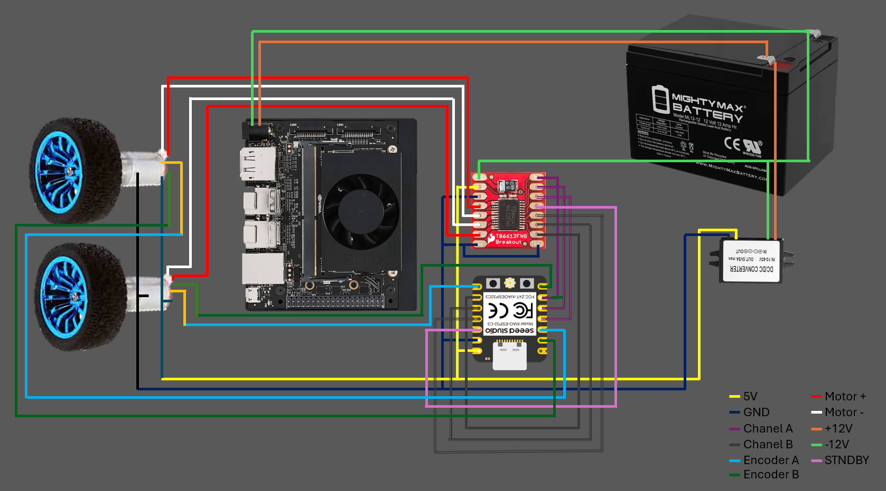

<p align="center">
  
</p>

<h1 align="center">ESP32 Robot Controller with Joystick 🎮</h1>
<p align="center">Host Joystick ➔ Serial ➔ ESP32 ➔ FeatherWing ➔ Motors</p>

<p align="center">
  <a href="https://platformio.org/">
    
  </a>
  <a href="https://docs.ros.org/en/humble/">
    
  </a>
  <a href="https://www.python.org/">
    
  </a>
  <a href="https://opensource.org/licenses/MIT">
    
  </a>
</p>


# 🕹️ ESP32 Robot Controller with Joystick over Serial

This project connects a USB joystick (e.g., EasySMX) to an ESP32-based robot controller using serial communication. The ESP32 receives speed and direction commands and drives motors via an Adafruit FeatherWing motor shield (PCA9685 + TB6612FNG). The system is designed to run a joystick interface on a host like Jetson Xavier and control motors with smooth differential drive.

---

## 📦 Project Structure

```
Mobile Robot/
│
├── Joystick/
│   └── joystick_to_serial.py       # Python script to send joystick data to ESP32
│
├── Motor Control/                  # PlatformIO project for ESP32 firmware
│   ├── src/
│   │   └── main.cpp                # Firmware: handles motor control via serial
│   ├── platformio.ini              # ESP32 build config (Seeed XIAO ESP32-C3)
│   └── ...                         # Other PlatformIO folders (.pio, lib, test, etc.)
│
├── Diagram.png                     # System wiring diagram
├── Diagram.pptx                    # Editable PowerPoint version of diagram
└── README.md                       # You are here :)
```

---

## 🤖 ROS 2 Integration Plans

This project is designed with future ROS 2 integration in mind, allowing the ESP32 to act as a low-level motor controller while high-level planning and sensing are handled on the Jetson Xavier using ROS 2 nodes.

### ✅ Current Architecture
- Joystick axis data is sent directly to the ESP32 via serial over USB.
- The ESP32 applies differential drive logic and controls the motors accordingly.
- Communication uses a simple `"X Y\n"` format for motor speeds from -255 to 255.

### 🚀 Future ROS 2 Upgrade Path

| Component            | Role                                |
|----------------------|-------------------------------------|
| `joy_node`           | Reads USB joystick via SDL or evdev |
| `teleop_twist_joy`   | Converts joystick axes to `cmd_vel` |
| `serial_bridge_node` | Sends `cmd_vel` as `"X Y"` strings over serial |
| `esp32_motor_driver` | Runs on ESP32 to parse and execute commands |

Additional plans include:
- Publishing encoder feedback from ESP32 for `odom`
- Creating a Isaac Sim digital twin for development and validation

---

## 🚦 System Overview

- **Host system:** Jetson Xavier (Linux) or PC (Windows)
- **Microcontroller:** Seeed XIAO ESP32-C3
- **Motor driver:** Adafruit FeatherWing (PCA9685 + 2×TB6612FNG)
- **Control interface:** USB joystick (e.g., EasySMX)
- **Communication:** Serial over USB (`/dev/ttyACM0` or `COMx`)
- **Frameworks:** Arduino (ESP32), Python with `pygame` and `pyserial`

---

## 🔧 Requirements

### Microcontroller (ESP32) side:
- [PlatformIO](https://platformio.org/)
- ESP32 board support (set to `seeed_xiao_esp32c3`)
- Libraries:
  - Adafruit BusIO
  - Adafruit PWM Servo Driver Library
  - Adafruit Motor Shield V2 Library
  - SPI

```ini
lib_deps =
  adafruit/Adafruit BusIO
  adafruit/Adafruit PWM Servo Driver Library
  adafruit/Adafruit Motor Shield V2 Library
  SPI
```


---

### Host (Jetson/PC) side:
- Python 3.8 or newer
- `pygame`
- `pyserial`

Install with:
```bash
pip install pygame pyserial
```

---

## 🎮 Usage

### 1. Run on ESP32

Build and upload `main.cpp` using PlatformIO. It will:
- Initialize the FeatherWing
- Wait for serial input of joystick axis data (formatted as `"X Y\n"`)
- Apply differential drive logic to control two DC motors


### 2. Run on Jetson or PC

Use `joystick_to_serial.py` to:
- Auto-detect ESP32 serial port
- Read left joystick axis input
- Convert axis to X/Y values in `-255 to 255` range
- Send commands like `"120 -100\n"` over serial


> Note: On Jetson or Linux, you may need to install `joystick` and set:
```bash
sudo apt install joystick
export SDL_JOYSTICK_DEVICE=/dev/input/js0
```

---

## 🧠 Differential Drive Logic

```text
left_speed  = y + x
right_speed = y - x
```

- `x` controls turning
- `y` controls forward/backward
- Values are clamped to `-255 to 255`

---

## 🔌 Wiring

See `Diagram.png` for reference.

Key connections:
- ESP32 SDA/SCL (D4/D5) → FeatherWing I²C
- ESP32 GND ↔ FeatherWing GND
- FeatherWing VMOT → 6–12V motor supply
- Add 4.7k–10kΩ pull-up resistors to SDA/SCL if needed for I²C stability

---

## 🛠 Troubleshooting

- If joystick isn't detected: make sure it's initialized (`pygame.joystick.init()`)
- If serial port permission denied on Linux:
  ```bash
  sudo usermod -a -G dialout $USER
  ```
- If FeatherWing isn't found at startup:
  - Add a delay before `AFMS.begin()`
  - Ensure clean I²C wiring and pull-ups

---

## 📸 Demo

<p align="center">
  
</p>

---

## 📜 License

MIT License. Credit to Articulated Robotics for inspiration on joystick-to-serial architecture.
